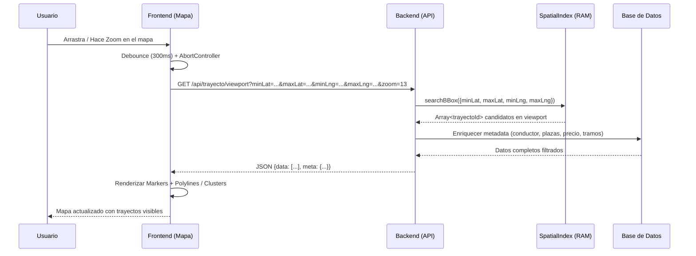

# Visión y Flujo Interactivo - Exploración de Trayectos en Mapa

## 1. Objetivo
Permitir al usuario explorar visualmente los trayectos activos disponibles mediante un mapa interactivo, donde al desplazar o hacer zoom, se muestren en tiempo real los trayectos que intersectan el área visible (viewport).

---

## 2. Diagrama de Secuencia

---

## 3. Estados del Mapa

### 3.1 Búsqueda Activa en Viewport (Modo Exploración)
- **Trigger:** Evento `moveend` o `zoomend` del mapa.
- **Comportamiento:** Consultar trayectos que intersectan el bounding box actual.
- **Filtros opcionales:** Fecha, plazas mínimas, precio máximo.
- **Respuesta:** Lista paginada (máx 50-100) con geometría según nivel de zoom.

### 3.2 Filtros Cruzados
- El usuario aplica filtros (fecha, plazas, precio) mientras navega el mapa.
- Los parámetros de filtro se añaden como query params adicionales.
- El backend combina filtro espacial (R-Tree) + filtros de atributos (DB).

### 3.3 Modo Selección / Detalle
- **Trigger:** Click en un marcador (pin) o en una polilínea.
- **Comportamiento:** Abrir panel lateral / modal con detalle completo del trayecto.
- **Datos:** Origen/Destino exactos, hora, conductor, plazas, precio, tramos intermedios, políticas.

---

## 4. Manejo de Errores y Casos Límite

| Caso | Estrategia |
|------|------------|
| **Viewport cruza meridiano ±180°** | Normalizar coordenadas: si `minLng > maxLng`, dividir en dos búsquedas o usar lógica de "wrapping". |
| **Viewport global (zoom 1-4)** | Devolver solo clusters/agregados; limitar a `precision=bounds`; máximo 200 resultados. |
| **Viewport extremadamente pequeño (zoom 19+)** | Aplicar `precision=full`; devolver todos los tramos; limitar radio de búsqueda a 500m. |
| **Petición cancelada (AbortController)** | Backend detecta `req.signal.aborted` y libera recursos temprano. |
| **Sin resultados en viewport** | Respuesta 200 con `data: []` y `meta.totalMatches: 0`; frontend muestra estado vacío. |
| **Error de validación coords** | Respuesta 400 con detalles Zod; frontend muestra toast de error. |

---

## 5. Parámetros de Control de Calidad (SLA)

| Métrica | Objetivo |
|---------|----------|
| Latencia P95 (memoria + DB) | < 150 ms |
| Latencia P99 | < 300 ms |
| Throughput | > 200 req/s por instancia |
| Tasa de error 5xx | < 0.1% |
| Tamaño payload típico (zoom 13) | 15-40 KB (gzip ~3-8 KB) |